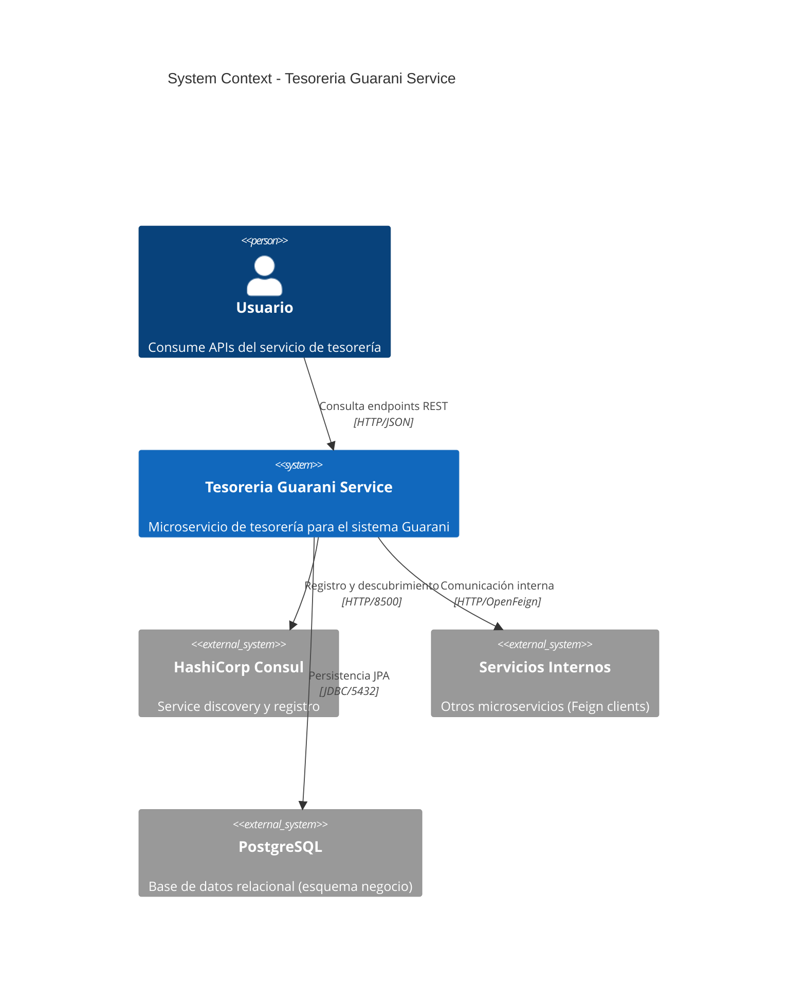
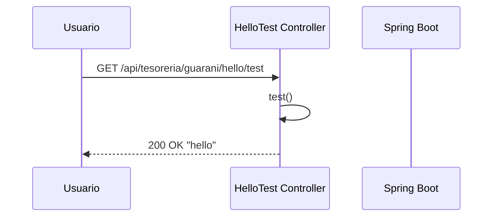
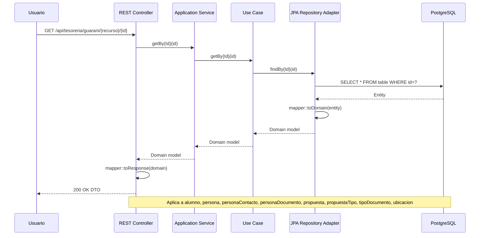

# UM.tesoreria.guarani-service

[](https://spring.io/projects/spring-boot)
[](https://openjdk.org/projects/jdk/25/)
[](LICENSE)
[](pom.xml)

Microservicio de tesorería integrado con el sistema Guarani. Proporciona APIs REST para la gestión de alumnos, personas, contactos de personas, documentos de personas, propuestas, tipos de propuestas, tipos de documentos y ubicaciones, con persistencia JPA/PostgreSQL, registro en Consul, comunicación Feign con otros microservicios, y documentación OpenAPI.

## Arquitectura

### Diagrama de Contexto



### Diagrama de Contenedores

```mermaid
C4Container
    title Container Diagram - Tesoreria Guarani Service

    Person(user, "Usuario", "Consume APIs")

    System_Boundary(guarani, "Tesoreria Guarani Service") {
        Container(api, "API REST", "Spring Boot, Tomcat", "Expone endpoints REST en puerto 8080")
        Container(controller, "Controllers", "Spring MVC", "Maneja solicitudes HTTP")
        Container(service, "Services", "Java", "Lógica de negocio")
        Container(hexagonal, "Hexagonal Modules", "Java", "Alumno, Persona, PersonaContacto, PersonaDocumento, Propuesta, PropuestaTipo, TipoDocumento, Ubicacion")
        Container(jpa, "JPA Repositories", "Spring Data JPA", "Persistencia y mapeo ORM")
        Container(client, "Feign Clients", "OpenFeign", "Clientes HTTP declarativos")
        Container(cache, "Cache Layer", "Caffeine", "Caché en memoria")
        Container(openapi, "API Docs", "SpringDoc OpenAPI", "Documentación Swagger UI")
    }

    System_Ext(consul, "Consul", "Service discovery :8500")
    System_Ext(internal_svc, "Servicios Internos", "Microservicios del ecosistema")
    System_Ext(postgresql, "PostgreSQL", "Base de datos (esquema negocio)")

    Rel(user, api, "HTTP", "REST/JSON")
    Rel(api, controller, "Enrutamiento")
    Rel(controller, hexagonal, "Delega a módulos")
    Rel(controller, service, "Llamadas")
    Rel(hexagonal, jpa, "Persistencia")
    Rel(service, client, "Invocación")
    Rel(service, cache, "Cache consultas")
    Rel(client, internal_svc, "HTTP/Feign")
    Rel(jpa, postgresql, "JDBC", "5432")
    Rel(guarani, consul, "Registro", "HTTP")
```

### Diagrama de Secuencia — Endpoint Hello



### Diagrama de Secuencia — Endpoints Hexagonales



### Diagrama de Secuencia — Endpoints Hexagonales (Colección)

```mermaid
sequenceDiagram
    participant User as Usuario
    participant REST as REST Controller
    participant Service as Application Service
    participant UseCase as Use Case
    participant JPA as JPA Repository Adapter
    participant DB as PostgreSQL

    User->>REST: GET /api/tesoreria/guarani/{recurso}/
    REST->>Service: getAll{Recursos}()
    Service->>UseCase: getAll{Recursos}()
    UseCase->>JPA: findAll()
    JPA->>DB: SELECT * FROM table
    DB-->>JPA: List&lt;Entity&gt;
    JPA->>JPA: stream().map(mapper::toDomain)
    JPA-->>UseCase: List&lt;Domain&gt;
    UseCase-->>Service: List&lt;Domain&gt;
    Service-->>REST: List&lt;Domain&gt;
    REST->>REST: stream().map(mapper::toResponse)
    REST-->>User: 200 OK List&lt;DTO&gt;
    Note over REST,DB: Actualmente implementado en propuesta, propuestaTipo, tipoDocumento y ubicacion
```

### Estructura del Proyecto

```mermaid
classDiagram
    class GuaraniApplication {
        +main(String[] args) void
    }

    class GuaraniConfiguration {
        <<Configuration>>
        <<EnableFeignClients>>
    }

    class HelloTest {
        <<RestController>>
        +test() ResponseEntity~String~
    }

    class AlumnoGuaraniController {
        <<RestController>>
        +getAlumnoGuarani(alumno) ResponseEntity
        +getAlumnosByPropuestaTipo(propuestaTipo) ResponseEntity
    }

    class PersonaGuaraniController {
        <<RestController>>
        +getPersonaGuarani(persona) ResponseEntity
    }

    class PersonaContactoGuaraniController {
        <<RestController>>
        +getPersonaContactoGuarani(personaContacto) ResponseEntity
    }

    class PersonaDocumentoGuaraniController {
        <<RestController>>
        +getPersonaDocumentoGuarani(documento) ResponseEntity
    }

    class PropuestaGuaraniController {
        <<RestController>>
        +getPropuestaGuarani(propuesta) ResponseEntity
        +getAllPropuestas() ResponseEntity
    }

    class PropuestaTipoGuaraniController {
        <<RestController>>
        +getPropuestaTipoGuarani(propuestaTipo) ResponseEntity
        +getAllPropuestaTipos() ResponseEntity
    }

    class TipoDocumentoGuaraniController {
        <<RestController>>
        +getTipoDocumentoGuarani(tipoDocumento) ResponseEntity
        +getAllTipoDocumentos() ResponseEntity
    }

    class UbicacionGuaraniController {
        <<RestController>>
        +getUbicacionGuarani(ubicacion) ResponseEntity
        +getAllUbicaciones() ResponseEntity
    }

    class AlumnoGuaraniService {
        <<Service>>
    }

    class PersonaGuaraniService {
        <<Service>>
    }

    class PersonaContactoGuaraniService {
        <<Service>>
    }

    class PersonaDocumentoGuaraniService {
        <<Service>>
    }

    class PropuestaGuaraniService {
        <<Service>>
    }

    class PropuestaTipoGuaraniService {
        <<Service>>
    }

    class TipoDocumentoGuaraniService {
        <<Service>>
    }

    class UbicacionGuaraniService {
        <<Service>>
    }

    class GuaraniApplicationTests {
        <<SpringBootTest>>
        +contextLoads() void
    }

    GuaraniApplication --> GuaraniConfiguration : uses
    AlumnoGuaraniController --> AlumnoGuaraniService : uses
    PersonaGuaraniController --> PersonaGuaraniService : uses
    PersonaContactoGuaraniController --> PersonaContactoGuaraniService : uses
    PersonaDocumentoGuaraniController --> PersonaDocumentoGuaraniService : uses
    PropuestaGuaraniController --> PropuestaGuaraniService : uses
    PropuestaTipoGuaraniController --> PropuestaTipoGuaraniService : uses
    TipoDocumentoGuaraniController --> TipoDocumentoGuaraniService : uses
    UbicacionGuaraniController --> UbicacionGuaraniService : uses
```



### Endpoints de la API

| Método | Endpoint | Descripción |
|--------|----------|-------------|
| GET | `/api/tesoreria/guarani/hello/test` | Health check del servicio |
| GET | `/api/tesoreria/guarani/alumno/{id}` | Obtiene un alumno por ID |
| GET | `/api/tesoreria/guarani/alumno/propuestaTipo/{propuestaTipo}` | Obtiene alumnos por tipo de propuesta |
| GET | `/api/tesoreria/guarani/persona/{id}` | Obtiene una persona por ID |
| GET | `/api/tesoreria/guarani/personaContacto/{id}` | Obtiene un contacto de persona por ID |
| GET | `/api/tesoreria/guarani/personaDocumento/{id}` | Obtiene un documento de persona por ID |
| GET | `/api/tesoreria/guarani/propuesta/` | Obtiene todas las propuestas |
| GET | `/api/tesoreria/guarani/propuesta/{id}` | Obtiene una propuesta por ID |
| GET | `/api/tesoreria/guarani/propuestaTipo/` | Obtiene todos los tipos de propuesta |
| GET | `/api/tesoreria/guarani/propuestaTipo/{id}` | Obtiene un tipo de propuesta por ID |
| GET | `/api/tesoreria/guarani/tipoDocumento/` | Obtiene todos los tipos de documento |
| GET | `/api/tesoreria/guarani/tipoDocumento/{id}` | Obtiene un tipo de documento por ID |
| GET | `/api/tesoreria/guarani/ubicacion/` | Obtiene todas las ubicaciones |
| GET | `/api/tesoreria/guarani/ubicacion/{id}` | Obtiene una ubicación por ID |

```
src/
├── main/
│   ├── java/um/tesoreria/guarani/
│   │   ├── GuaraniApplication.java
│   │   ├── configuration/
│   │   │   └── GuaraniConfiguration.java
│   │   ├── test/
│   │   │   └── HelloTest.java
│   │   └── hexagonal/guarani/
│   │       ├── alumno/
│   │       ├── persona/
│   │       ├── personaContacto/
│   │       ├── personaDocumento/
│   │       ├── propuesta/
│   │       ├── propuestaTipo/
│   │       ├── tipoDocumento/
│   │       └── ubicacion/
│   └── resources/
│       ├── bootstrap.yml
│       └── banner.txt
└── test/
    └── java/um/tesoreria/guarani/
        └── GuaraniApplicationTests.java
```

## Tecnologías

| Tecnología | Versión | Propósito |
|---|---|---|
| Java | 25 | Lenguaje de programación |
| Spring Boot | 4.1.0 | Framework principal |
| Spring Cloud | 2025.1.2 | Microservicios |
| Spring Data JPA | - | Persistencia ORM |
| PostgreSQL | - | Base de datos relacional |
| Consul Discovery | - | Service discovery |
| OpenFeign | - | Clientes HTTP declarativos |
| Caffeine | - | Caché en memoria |
| SpringDoc OpenAPI | 3.0.3 | Documentación de APIs |
| Lombok | - | Reducción de boilerplate |
| Maven | 3+ | Build tool |

## Requisitos

- **Java 25** (JDK)
- **Maven 3.x** (o usar el wrapper `./mvnw`)
- **PostgreSQL** (base de datos, esquema `negocio`)
- **Consul** (para service discovery)
- **Docker** (opcional, para contenedor)

## Inicio Rápido

### Compilar

```bash
./mvnw clean package
```

### Ejecutar

```bash
./mvnw spring-boot:run
```

### Docker

```bash
docker build -t um-tesoreria-guarani .
docker run -p 8080:8080 um-tesoreria-guarani
```

## Configuración

Las propiedades se definen en `bootstrap.yml` y pueden sobrescribirse por variable de entorno:

| Variable | Por Defecto | Descripción |
|---|---|---|
| `APP_PORT` | `8080` | Puerto del servidor |
| `APP_LOGGING` | `debug` | Nivel de log |
| `APP_SERVER` | `server` | Host de PostgreSQL |
| `APP_DATABASE` | `database` | Nombre de la base de datos |
| `APP_USERNAME` | `username` | Usuario de PostgreSQL |
| `APP_PASSWORD` | `password` | Contraseña de PostgreSQL |

El servicio se registra en Consul con:
- **Nombre:** `tesoreria-guarani-service`
- **Tags:** `tesoreria`, `guarani`

## API

La documentación interactiva de la API está disponible en:

- **Swagger UI:** `http://localhost:8080/swagger-ui/index.html`
- **OpenAPI JSON:** `http://localhost:8080/v3/api-docs`
- **Actuator:** `http://localhost:8080/actuator`

## Licencia

Este proyecto está licenciado bajo la **GNU Affero General Public License v3.0** (AGPL-3.0). Ver el archivo [LICENSE](LICENSE) para más detalles.
