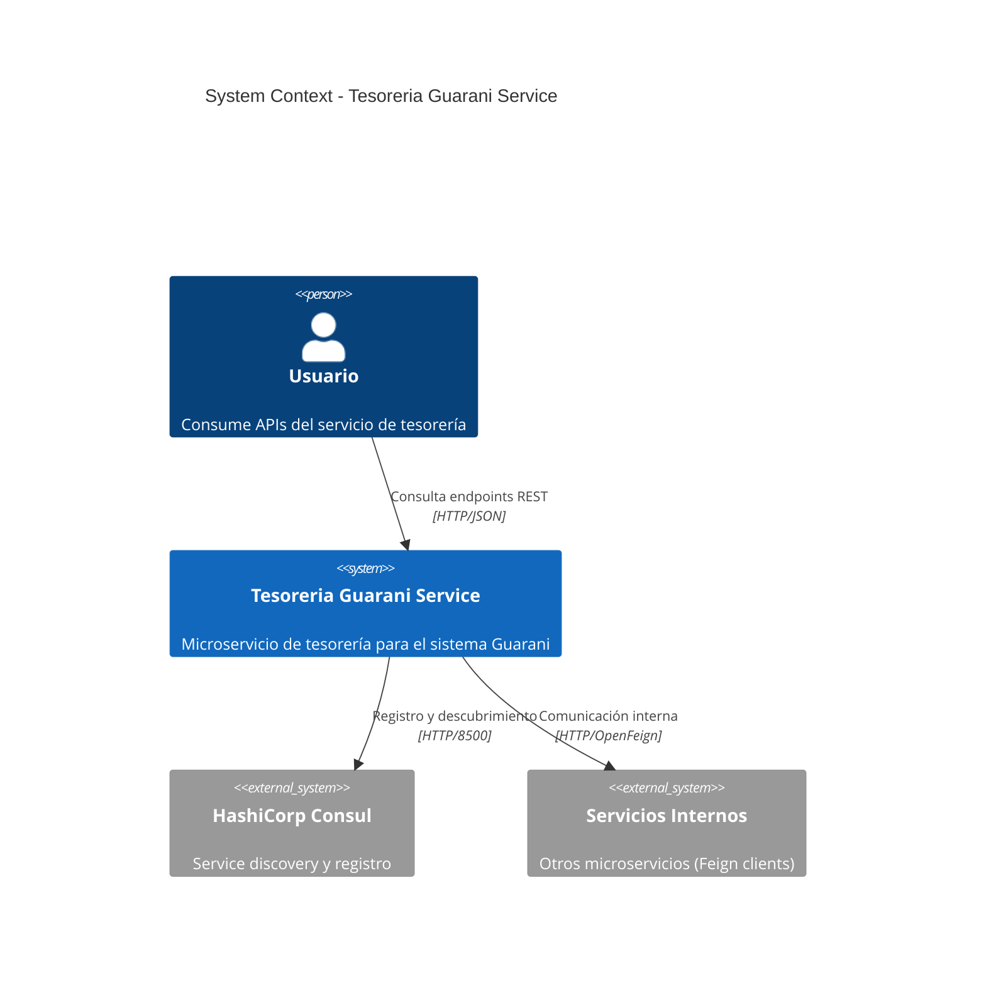
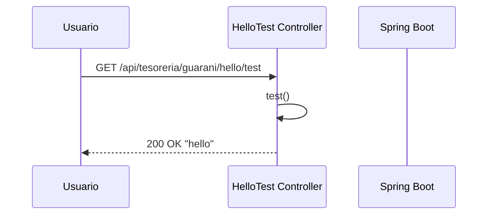
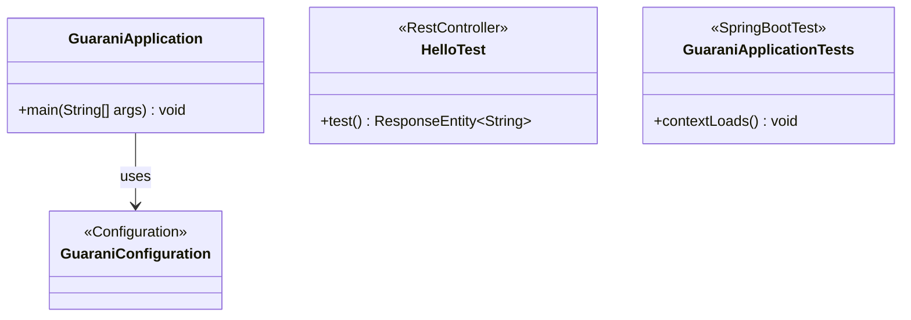

# UM.tesoreria.guarani-service

[](https://spring.io/projects/spring-boot)
[](https://openjdk.org/projects/jdk/25/)
[](LICENSE)
[](pom.xml)

Microservicio de tesorería integrado con el sistema Guarani. Proporciona APIs REST para la gestión de operaciones de tesorería, con registro en Consul, comunicación Feign con otros microservicios, y documentación OpenAPI.

## Arquitectura

### Diagrama de Contexto



### Diagrama de Contenedores

```mermaid
C4Container
    title Container Diagram - Tesoreria Guarani Service

    Person(user, "Usuario", "Consume APIs")

    System_Boundary(guarani, "Tesoreria Guarani Service") {
        Container(api, "API REST", "Spring Boot, Tomcat", "Expone endpoints REST en puerto 8080")
        Container(controller, "Controllers", "Spring MVC", "Maneja solicitudes HTTP")
        Container(service, "Services", "Java", "Lógica de negocio")
        Container(client, "Feign Clients", "OpenFeign", "Clientes HTTP declarativos")
        Container(cache, "Cache Layer", "Caffeine", "Caché en memoria")
        Container(openapi, "API Docs", "SpringDoc OpenAPI", "Documentación Swagger UI")
    }

    System_Ext(consul, "Consul", "Service discovery :8500")
    System_Ext(internal_svc, "Servicios Internos", "Microservicios del ecosistema")

    Rel(user, api, "HTTP", "REST/JSON")
    Rel(api, controller, "Enrutamiento")
    Rel(controller, service, "Llamadas")
    Rel(service, client, "Invocación")
    Rel(service, cache, "Cache consultas")
    Rel(client, internal_svc, "HTTP/Feign")
    Rel(guarani, consul, "Registro", "HTTP")
```

### Diagrama de Secuencia — Endpoint Hello



### Estructura del Proyecto



```
src/
├── main/
│   ├── java/um/tesoreria/guarani/
│   │   ├── GuaraniApplication.java
│   │   ├── configuration/
│   │   │   └── GuaraniConfiguration.java
│   │   └── test/
│   │       └── HelloTest.java
│   └── resources/
│       ├── bootstrap.yml
│       └── banner.txt
└── test/
    └── java/um/tesoreria/guarani/
        └── GuaraniApplicationTests.java
```

## Tecnologías

| Tecnología | Versión | Propósito |
|---|---|---|
| Java | 25 | Lenguaje de programación |
| Spring Boot | 4.0.7 | Framework principal |
| Spring Cloud | 2025.1.1 | Microservicios |
| Consul Discovery | - | Service discovery |
| OpenFeign | - | Clientes HTTP declarativos |
| Caffeine | - | Caché en memoria |
| SpringDoc OpenAPI | 3.0.2 | Documentación de APIs |
| Maven | 3+ | Build tool |

## Requisitos

- **Java 25** (JDK)
- **Maven 3.x** (o usar el wrapper `./mvnw`)
- **Consul** (para service discovery)
- **Docker** (opcional, para contenedor)

## Inicio Rápido

### Compilar

```bash
./mvnw clean package
```

### Ejecutar

```bash
./mvnw spring-boot:run
```

### Docker

```bash
docker build -t um-tesoreria-guarani .
docker run -p 8080:8080 um-tesoreria-guarani
```

## Configuración

Las propiedades se definen en `bootstrap.yml` y pueden sobrescribirse por variable de entorno:

| Variable | Por Defecto | Descripción |
|---|---|---|
| `APP_PORT` | `8080` | Puerto del servidor |
| `APP_LOGGING` | `debug` | Nivel de log |

El servicio se registra en Consul con:
- **Nombre:** `tesoreria-guarani-service`
- **Tags:** `tesoreria`, `report`

## API

La documentación interactiva de la API está disponible en:

- **Swagger UI:** `http://localhost:8080/swagger-ui/index.html`
- **OpenAPI JSON:** `http://localhost:8080/v3/api-docs`
- **Actuator:** `http://localhost:8080/actuator`

## Licencia

Este proyecto está licenciado bajo la **GNU Affero General Public License v3.0** (AGPL-3.0). Ver el archivo [LICENSE](LICENSE) para más detalles.
