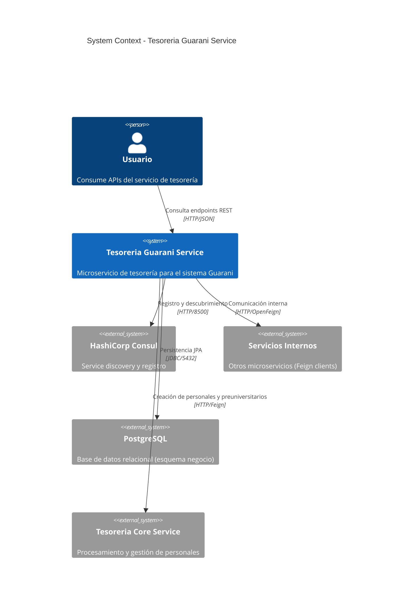
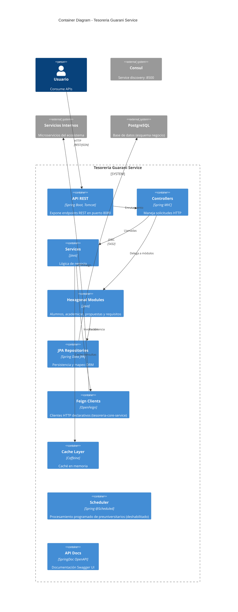
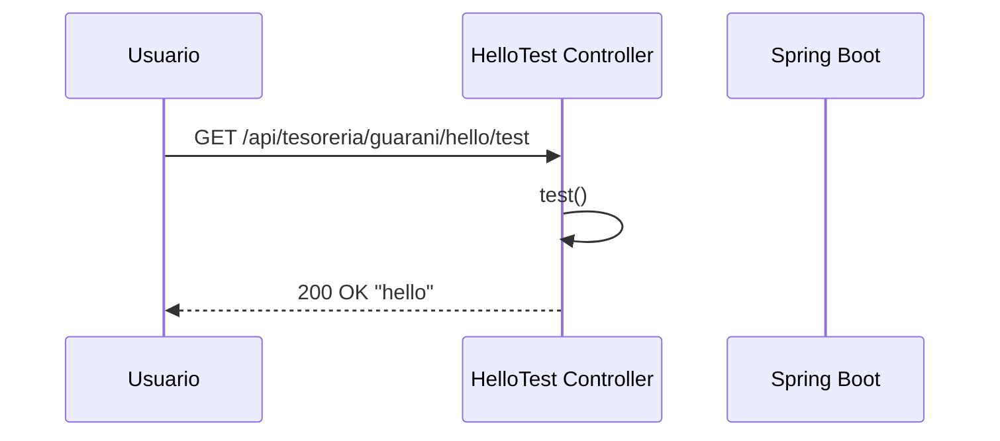
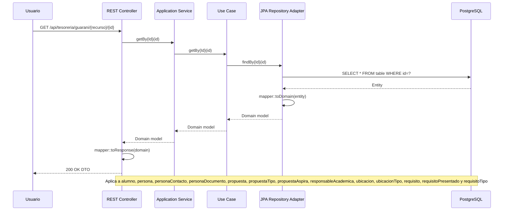
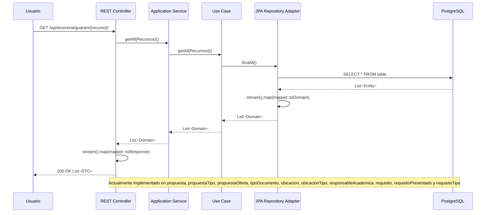
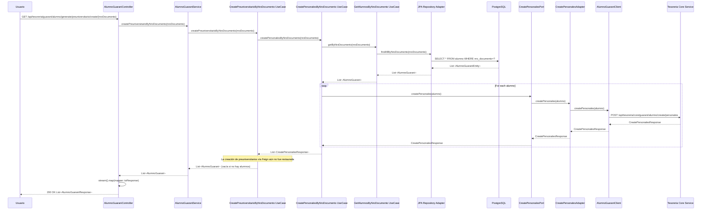
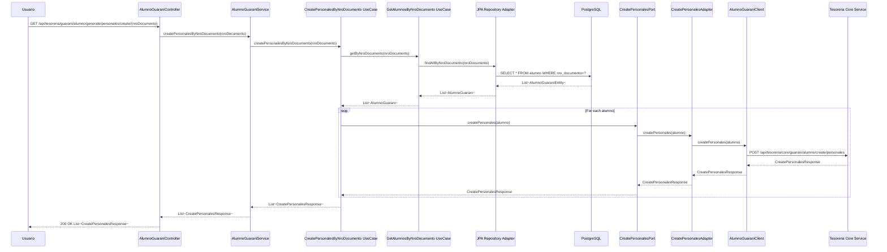
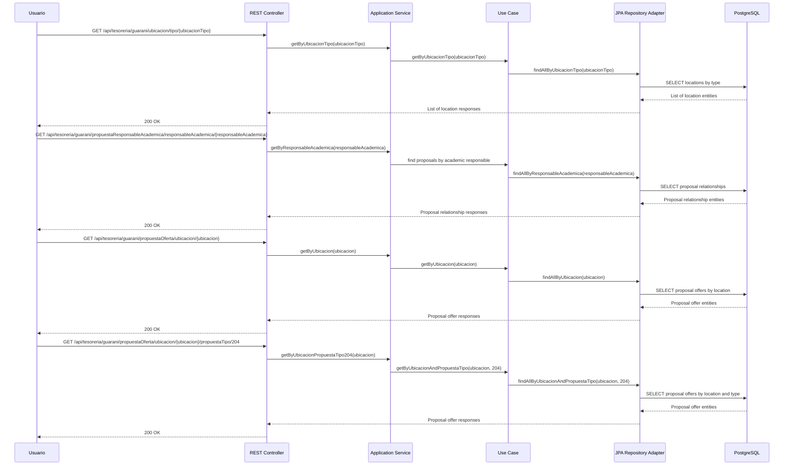

# UM.tesoreria.guarani-service

[](https://spring.io/projects/spring-boot)
[](https://openjdk.org/projects/jdk/25/)
[](LICENSE)
[](pom.xml)

Microservicio de tesorería integrado con el sistema Guarani (v5.0.0). Proporciona APIs REST para la gestión de alumnos, personas, contactos de personas, documentos de personas, propuestas, ofertas de propuestas, tipos de propuestas, propuestas aspiras, responsables académicas, ubicaciones y tipos de ubicación, requisitos, requisitos presentados y tipos de requisitos, con persistencia JPA/PostgreSQL, registro en Consul, comunicación Feign con otros microservicios, creación de personales y preuniversitarios por documento, y documentación OpenAPI.

## Arquitectura

### Diagrama de Contexto


```mermaid
C4Context
    title System Context - Tesoreria Guarani Service

    Person(user, "Usuario", "Consume APIs del servicio de tesorería")

    System(guarani, "Tesoreria Guarani Service", "Microservicio de tesorería para el sistema Guarani")

    System_Ext(consul, "HashiCorp Consul", "Service discovery y registro")
    System_Ext(feign_clients, "Servicios Internos", "Otros microservicios (Feign clients)")
    System_Ext(postgresql, "PostgreSQL", "Base de datos relacional (esquema negocio)")
    System_Ext(core, "Tesoreria Core Service", "Procesamiento y gestión de personales")

    Rel(user, guarani, "Consulta endpoints REST", "HTTP/JSON")
    Rel(guarani, consul, "Registro y descubrimiento", "HTTP/8500")
    Rel(guarani, feign_clients, "Comunicación interna", "HTTP/OpenFeign")
    Rel(guarani, postgresql, "Persistencia JPA", "JDBC/5432")
    Rel(guarani, core, "Creación de personales y preuniversitarios", "HTTP/Feign")
```

### Diagrama de Contenedores


```mermaid
C4Container
    title Container Diagram - Tesoreria Guarani Service

    Person(user, "Usuario", "Consume APIs")

    System_Boundary(guarani, "Tesoreria Guarani Service") {
        Container(api, "API REST", "Spring Boot, Tomcat", "Expone endpoints REST en puerto 8080")
        Container(controller, "Controllers", "Spring MVC", "Maneja solicitudes HTTP")
        Container(service, "Services", "Java", "Lógica de negocio")
        Container(hexagonal, "Hexagonal Modules", "Java", "Alumnos, academicas, propuestas y requisitos")
        Container(jpa, "JPA Repositories", "Spring Data JPA", "Persistencia y mapeo ORM")
        Container(client, "Feign Clients", "OpenFeign", "Clientes HTTP declarativos (tesoreria-core-service)")
        Container(cache, "Cache Layer", "Caffeine", "Caché en memoria")
        Container(scheduler, "Scheduler", "Spring @Scheduled", "Procesamiento programado de preuniversitarios (deshabilitado)")
        Container(openapi, "API Docs", "SpringDoc OpenAPI", "Documentación Swagger UI")
    }

    System_Ext(consul, "Consul", "Service discovery :8500")
    System_Ext(internal_svc, "Servicios Internos", "Microservicios del ecosistema")
    System_Ext(postgresql, "PostgreSQL", "Base de datos (esquema negocio)")

    Rel(user, api, "HTTP", "REST/JSON")
    Rel(api, controller, "Enrutamiento")
    Rel(controller, hexagonal, "Delega a módulos")
    Rel(controller, service, "Llamadas")
    Rel(hexagonal, jpa, "Persistencia")
    Rel(service, client, "Invocación")
    Rel(service, cache, "Cache consultas")
    Rel(client, internal_svc, "HTTP/Feign")
    Rel(jpa, postgresql, "JDBC", "5432")
```

### Diagrama de Secuencia — Endpoint Hello


```mermaid
sequenceDiagram
    participant User as Usuario
    participant Hello as HelloTest Controller
    participant SB as Spring Boot

    User->>Hello: GET /api/tesoreria/guarani/hello/test
    Hello->>Hello: test()
    Hello-->>User: 200 OK "hello"
```

### Diagrama de Secuencia — Endpoints Hexagonales


```mermaid
sequenceDiagram
    participant User as Usuario
    participant REST as REST Controller
    participant Service as Application Service
    participant UseCase as Use Case
    participant JPA as JPA Repository Adapter
    participant DB as PostgreSQL

    User->>REST: GET /api/tesoreria/guarani/{recurso}/{id}
    REST->>Service: getBy{Id}(id)
    Service->>UseCase: getBy{Id}(id)
    UseCase->>JPA: findBy{Id}(id)
    JPA->>DB: SELECT * FROM table WHERE id=?
    DB-->>JPA: Entity
    JPA->>JPA: mapper::toDomain(entity)
    JPA-->>UseCase: Domain model
    UseCase-->>Service: Domain model
    Service-->>REST: Domain model
    REST->>REST: mapper::toResponse(domain)
    REST-->>User: 200 OK DTO
    Note over REST,DB: Aplica a alumno, persona, personaContacto, personaDocumento, propuesta, propuestaTipo, propuestaAspira, responsableAcademica, ubicacion, ubicacionTipo, requisito, requisitoPresentado y requisitoTipo
```

### Diagrama de Secuencia — Endpoints Hexagonales (Colección)


```mermaid
sequenceDiagram
    participant User as Usuario
    participant REST as REST Controller
    participant Service as Application Service
    participant UseCase as Use Case
    participant JPA as JPA Repository Adapter
    participant DB as PostgreSQL

    User->>REST: GET /api/tesoreria/guarani/{recurso}/
    REST->>Service: getAll{Recursos}()
    Service->>UseCase: getAll{Recursos}()
    UseCase->>JPA: findAll()
    JPA->>DB: SELECT * FROM table
    DB-->>JPA: List~Entity~
    JPA->>JPA: stream().map(mapper::toDomain)
    JPA-->>UseCase: List~Domain~
    UseCase-->>Service: List~Domain~
    Service-->>REST: List~Domain~
    REST->>REST: stream().map(mapper::toResponse)
    REST-->>User: 200 OK List~DTO~
    Note over REST,DB: Actualmente implementado en propuesta, propuestaTipo, propuestaOferta, tipoDocumento, ubicacion, ubicacionTipo, responsableAcademica, requisito, requisitoPresentado y requisitoTipo
```

### Diagrama de Secuencia — Crear Preuniversitario por Documento


```mermaid
sequenceDiagram
    participant User as Usuario
    participant REST as AlumnoGuaraniController
    participant Service as AlumnoGuaraniService
    participant CBNUC as CreatePreuniversitarioByNroDocumento UseCase
    participant PersonalesUC as CreatePersonalesByNroDocumento UseCase
    participant GetUC as GetAlumnosByNroDocumento UseCase
    participant JPA as JPA Repository Adapter
    participant DB as PostgreSQL
    participant Port as CreatePersonalesPort
    participant Adapter as CreatePersonalesAdapter
    participant Feign as AlumnoGuaraniClient
    participant Core as Tesoreria Core Service

    User->>REST: GET /api/tesoreria/guarani/alumno/generate/preuniversitario/create/{nroDocumento}
    REST->>Service: createPreuniversitarioByNroDocumento(nroDocumento)
    Service->>CBNUC: createPreuniversitarioByNroDocumento(nroDocumento)
    CBNUC->>PersonalesUC: createPersonalesByNroDocumento(nroDocumento)
    PersonalesUC->>GetUC: getByNroDocumento(nroDocumento)
    GetUC->>JPA: findAllByNroDocumento(nroDocumento)
    JPA->>DB: SELECT * FROM alumno WHERE nro_documento=?
    DB-->>JPA: List~AlumnoGuaraniEntity~
    JPA-->>GetUC: List~AlumnoGuarani~
    GetUC-->>PersonalesUC: List~AlumnoGuarani~
    loop For each alumno
        PersonalesUC->>Port: createPersonales(alumno)
        Port->>Adapter: createPersonales(alumno)
        Adapter->>Feign: createPersonales(alumno)
        Feign->>Core: POST /api/tesoreria/core/guarani/alumno/create/personales
        Core-->>Feign: CreatePersonalesResponse
        Feign-->>Adapter: CreatePersonalesResponse
        Adapter-->>Port: CreatePersonalesResponse
        Port-->>PersonalesUC: CreatePersonalesResponse
    end
    PersonalesUC-->>CBNUC: List~CreatePersonalesResponse~
    Note over CBNUC: La creación de preuniversitarios vía Feign aún no fue restaurada
    CBNUC-->>Service: List~AlumnoGuarani~ (vacía si no hay alumnos)
    Service-->>REST: List~AlumnoGuarani~
    REST->>REST: stream().map(mapper::toResponse)
    REST-->>User: 200 OK List~AlumnoGuaraniResponse~
```

### Diagrama de Secuencia — Crear Personales por Documento


```mermaid
sequenceDiagram
    participant User as Usuario
    participant REST as AlumnoGuaraniController
    participant Service as AlumnoGuaraniService
    participant UseCase as CreatePersonalesByNroDocumento UseCase
    participant GetUC as GetAlumnosByNroDocumento UseCase
    participant JPA as JPA Repository Adapter
    participant DB as PostgreSQL
    participant Port as CreatePersonalesPort
    participant Adapter as CreatePersonalesAdapter
    participant Feign as AlumnoGuaraniClient
    participant Core as Tesoreria Core Service

    User->>REST: GET /api/tesoreria/guarani/alumno/generate/personales/create/{nroDocumento}
    REST->>Service: createPersonalesByNroDocumento(nroDocumento)
    Service->>UseCase: createPersonalesByNroDocumento(nroDocumento)
    UseCase->>GetUC: getByNroDocumento(nroDocumento)
    GetUC->>JPA: findAllByNroDocumento(nroDocumento)
    JPA->>DB: SELECT * FROM alumno WHERE nro_documento=?
    DB-->>JPA: List~AlumnoGuaraniEntity~
    JPA-->>GetUC: List~AlumnoGuarani~
    GetUC-->>UseCase: List~AlumnoGuarani~
    loop For each alumno
        UseCase->>Port: createPersonales(alumno)
        Port->>Adapter: createPersonales(alumno)
        Adapter->>Feign: createPersonales(alumno)
        Feign->>Core: POST /api/tesoreria/core/guarani/alumno/create/personales
        Core-->>Feign: CreatePersonalesResponse
        Feign-->>Adapter: CreatePersonalesResponse
        Adapter-->>Port: CreatePersonalesResponse
        Port-->>UseCase: CreatePersonalesResponse
    end
    UseCase-->>Service: List~CreatePersonalesResponse~
    Service-->>REST: List~CreatePersonalesResponse~
    REST-->>User: 200 OK List~CreatePersonalesResponse~
```

### Diagrama de Secuencia — Endpoints Académicos y de Propuestas


```mermaid
sequenceDiagram
    participant User as Usuario
    participant REST as REST Controller
    participant Service as Application Service
    participant UseCase as Use Case
    participant JPA as JPA Repository Adapter
    participant DB as PostgreSQL

    User->>REST: GET /api/tesoreria/guarani/ubicacion/tipo/{ubicacionTipo}
    REST->>Service: getByUbicacionTipo(ubicacionTipo)
    Service->>UseCase: getByUbicacionTipo(ubicacionTipo)
    UseCase->>JPA: findAllByUbicacionTipo(ubicacionTipo)
    JPA->>DB: SELECT locations by type
    DB-->>JPA: List of location entities
    JPA-->>REST: List of location responses
    REST-->>User: 200 OK

    User->>REST: GET /api/tesoreria/guarani/propuestaResponsableAcademica/responsableAcademica/{responsableAcademica}
    REST->>Service: getByResponsableAcademica(responsableAcademica)
    Service->>UseCase: find proposals by academic responsible
    UseCase->>JPA: findAllByResponsableAcademica(responsableAcademica)
    JPA->>DB: SELECT proposal relationships
    DB-->>JPA: Proposal relationship entities
    JPA-->>REST: Proposal relationship responses
    REST-->>User: 200 OK

    User->>REST: GET /api/tesoreria/guarani/propuestaOferta/ubicacion/{ubicacion}
    REST->>Service: getByUbicacion(ubicacion)
    Service->>UseCase: getByUbicacion(ubicacion)
    UseCase->>JPA: findAllByUbicacion(ubicacion)
    JPA->>DB: SELECT proposal offers by location
    DB-->>JPA: Proposal offer entities
    JPA-->>REST: Proposal offer responses
    REST-->>User: 200 OK

    User->>REST: GET /api/tesoreria/guarani/propuestaOferta/ubicacion/{ubicacion}/propuestaTipo/204
    REST->>Service: getByUbicacionPropuestaTipo204(ubicacion)
    Service->>UseCase: getByUbicacionAndPropuestaTipo(ubicacion, 204)
    UseCase->>JPA: findAllByUbicacionAndPropuestaTipo(ubicacion, 204)
    JPA->>DB: SELECT proposal offers by location and type
    DB-->>JPA: Proposal offer entities
    JPA-->>REST: Proposal offer responses
    REST-->>User: 200 OK
```

### Estructura del Proyecto


```mermaid
classDiagram
    class GuaraniApplication {
        +main(String[] args) void
    }

    class GuaraniConfiguration {
        <<Configuration>>
        <<EnableFeignClients>>
        <<EnableScheduling>>
    }

    class HelloTest {
        <<RestController>>
        +test() ResponseEntity~String~
    }

    class AlumnoGuaraniController {
        <<RestController>>
        +getAlumnoGuarani(alumno) ResponseEntity
        +getAlumnosByPropuestaTipo(propuestaTipo) ResponseEntity
        +getAlumnosByPropuestaTipoAndFechaLimite(propuestaTipo, fechaLimite) ResponseEntity
        +getAlumnosByNroDocumento(nroDocumento) ResponseEntity
        +createPersonalesByNroDocumento(nroDocumento) ResponseEntity
        +createPreuniversitarioByNroDocumento(nroDocumento) ResponseEntity
    }

    class PropuestaOfertaGuaraniController {
        <<RestController>>
        +getByUbicacion(ubicacion) ResponseEntity
        +getByUbicacionPropuestaTipo204(ubicacion) ResponseEntity
    }

    class PersonaGuaraniController {
        <<RestController>>
        +getPersonaGuarani(persona) ResponseEntity
    }

    class PersonaContactoGuaraniController {
        <<RestController>>
        +getPersonaContactoGuarani(personaContacto) ResponseEntity
    }

    class PersonaDocumentoGuaraniController {
        <<RestController>>
        +getPersonaDocumentoGuarani(documento) ResponseEntity
    }

    class PropuestaGuaraniController {
        <<RestController>>
        +getPropuestaGuarani(propuesta) ResponseEntity
        +getAllPropuestas() ResponseEntity
    }

    class PropuestaTipoGuaraniController {
        <<RestController>>
        +getPropuestaTipoGuarani(propuestaTipo) ResponseEntity
        +getAllPropuestaTipos() ResponseEntity
    }

    class TipoDocumentoGuaraniController {
        <<RestController>>
        +getTipoDocumentoGuarani(tipoDocumento) ResponseEntity
        +getAllTipoDocumentos() ResponseEntity
    }

    class UbicacionGuaraniController {
        <<RestController>>
        +getUbicacionGuarani(ubicacion) ResponseEntity
        +getAllUbicaciones() ResponseEntity
    }

    class RequisitoGuaraniController {
        <<RestController>>
        +getRequisitoGuarani(requisito) ResponseEntity
        +getAllRequisitos() ResponseEntity
        +getRequisitosByTipo(requisitoTipo) ResponseEntity
    }

    class RequisitoPresentadoGuaraniController {
        <<RestController>>
        +getRequisitoPresentadoGuarani(requisitoPresentado) ResponseEntity
        +getAllRequisitosPresentados() ResponseEntity
    }

    class RequisitoTipoGuaraniController {
        <<RestController>>
        +getRequisitoTipoGuarani(requisitoTipo) ResponseEntity
        +getAllRequisitoTipos() ResponseEntity
    }

    class PropuestaAspiraGuaraniController {
        <<RestController>>
        +getPropuestaAspiraGuarani(propuestaAspira) ResponseEntity
        +getByPropuestaUbicacionAndFechaInscripcion(propuesta, ubicacion, fechaDesde) ResponseEntity
    }

    class ResponsableAcademicaGuaraniController {
        <<RestController>>
        +getAllResponsablesAcademicas() ResponseEntity
    }

    class UbicacionTipoGuaraniController {
        <<RestController>>
        +getAllUbicacionTipos() ResponseEntity
    }

    class PropuestaResponsableAcademicaGuaraniController {
        <<RestController>>
        +getByResponsableAcademica(responsableAcademica) ResponseEntity
        +getByResponsableAcademicaAndPropuestaTipo(responsableAcademica) ResponseEntity
    }

    class AlumnoGuaraniService {
        <<Service>>
    }

    class PersonaGuaraniService {
        <<Service>>
    }

    class PersonaContactoGuaraniService {
        <<Service>>
    }

    class PersonaDocumentoGuaraniService {
        <<Service>>
    }

    class PropuestaGuaraniService {
        <<Service>>
    }

    class PropuestaTipoGuaraniService {
        <<Service>>
    }

    class TipoDocumentoGuaraniService {
        <<Service>>
    }

    class UbicacionGuaraniService {
        <<Service>>
    }

    class RequisitoGuaraniService {
        <<Service>>
    }

    class RequisitoPresentadoGuaraniService {
        <<Service>>
    }

    class RequisitoTipoGuaraniService {
        <<Service>>
    }

    class PropuestaAspiraGuaraniService {
        <<Service>>
    }

    class ResponsableAcademicaGuaraniService {
        <<Service>>
    }

    class UbicacionTipoGuaraniService {
        <<Service>>
    }

    class PropuestaResponsableAcademicaGuaraniService {
        <<Service>>
    }

    class PropuestaOfertaGuaraniService {
        <<Service>>
        +getByUbicacion(ubicacion) List~PropuestaOfertaGuarani~
        +getByUbicacionPropuestaTipo204(ubicacion) List~PropuestaOfertaGuarani~
    }

    class AlumnoGuaraniScheduler {
        <<Component>>
        +generatePreuniversitarios() void
    }

    class AlumnoGuaraniClient {
        <<FeignClient>>
        +createPreuniversitario(AlumnoGuarani) AlumnoGuarani
        +createPersonales(AlumnoGuarani) CreatePersonalesResponse
    }

    class CreatePersonalesResponse {
        <<DTO>>
        +Boolean result
        +AlumnoGuarani alumnoGuarani
        +PersonaCoreResponse persona
        +DomicilioCoreResponse domicilio
    }

    class PersonaCoreResponse {
        <<DTO>>
        +Integer uniqueId
        +Integer personaId
        +Integer documentoId
        +String apellido
        +String nombre
        +String sexo
        +String primero
        +String cuit
        +String cbu
        +String password
        +String hpum
    }

    class DomicilioCoreResponse {
        <<DTO>>
        +Integer domicilioId
        +Integer personaId
        +Integer documentoId
        +OffsetDateTime fecha
        +String calle
        +String puerta
        +String piso
        +String dpto
        +String telefono
        +String movil
        +String observaciones
        +String codigoPostal
        +Integer facultadId
        +Integer provinciaId
        +Integer localidadId
        +String emailPersonal
        +String emailInstitucional
        +String laboral
        +String emailPagador
    }

    class CreatePreuniversitarioByNroDocumentoUseCase {
        <<Interface>>
        +createPreuniversitarioByNroDocumento(String) List~AlumnoGuarani~
    }

    class CreatePersonalesByNroDocumentoUseCase {
        <<Interface>>
        +createPersonalesByNroDocumento(String) List~CreatePersonalesResponse~
    }

    class CreatePersonalesPort {
        <<Interface>>
        +createPersonales(AlumnoGuarani) CreatePersonalesResponse
    }

    class GetAlumnosByPropuestaTipoAndFechaInscripcionUseCase {
        <<Interface>>
        +getByPropuestaTipoAndFechaInscripcionAfter(Integer, LocalDate) List~AlumnoGuarani~
    }

    class GetAlumnosByNroDocumentoUseCase {
        <<Interface>>
        +getByNroDocumento(nroDocumento) List~AlumnoGuarani~
    }

    class GetUbicacionesByUbicacionTipoUseCase {
        <<Interface>>
        +getByUbicacionTipo(ubicacionTipo) List~UbicacionGuarani~
    }

    class Jsonifier {
        <<Utility>>
        +builder(T) Builder~T~
    }

    class GuaraniApplicationTests {
        <<SpringBootTest>>
        +contextLoads() void
    }

    GuaraniApplication --> GuaraniConfiguration : uses
    AlumnoGuaraniScheduler --> AlumnoGuaraniService : schedules
    AlumnoGuaraniService --> GetAlumnosByPropuestaTipoAndFechaInscripcionUseCase : uses
    AlumnoGuaraniService --> CreatePreuniversitarioByNroDocumentoUseCase : uses
    AlumnoGuaraniService --> CreatePersonalesByNroDocumentoUseCase : uses
    CreatePreuniversitarioByNroDocumentoUseCase --> CreatePersonalesByNroDocumentoUseCase : delegates
    CreatePersonalesByNroDocumentoUseCase --> GetAlumnosByNroDocumentoUseCase : queries
    CreatePersonalesByNroDocumentoUseCase --> CreatePersonalesPort : delegates
    CreatePersonalesPort --> AlumnoGuaraniClient : calls
    AlumnoGuaraniController --> AlumnoGuaraniService : uses
    PersonaGuaraniController --> PersonaGuaraniService : uses
    PersonaContactoGuaraniController --> PersonaContactoGuaraniService : uses
    PersonaDocumentoGuaraniController --> PersonaDocumentoGuaraniService : uses
    PropuestaGuaraniController --> PropuestaGuaraniService : uses
    PropuestaTipoGuaraniController --> PropuestaTipoGuaraniService : uses
    PropuestaAspiraGuaraniController --> PropuestaAspiraGuaraniService : uses
    ResponsableAcademicaGuaraniController --> ResponsableAcademicaGuaraniService : uses
    UbicacionTipoGuaraniController --> UbicacionTipoGuaraniService : uses
    PropuestaResponsableAcademicaGuaraniController --> PropuestaResponsableAcademicaGuaraniService : uses
    PropuestaOfertaGuaraniController --> PropuestaOfertaGuaraniService : uses
    TipoDocumentoGuaraniController --> TipoDocumentoGuaraniService : uses
    UbicacionGuaraniController --> UbicacionGuaraniService : uses
    RequisitoGuaraniController --> RequisitoGuaraniService : uses
    RequisitoPresentadoGuaraniController --> RequisitoPresentadoGuaraniService : uses
    RequisitoTipoGuaraniController --> RequisitoTipoGuaraniService : uses
    UbicacionGuaraniService --> GetUbicacionesByUbicacionTipoUseCase : uses
```

### Endpoints de la API

| Método | Endpoint | Descripción |
|--------|----------|-------------|
| GET | `/api/tesoreria/guarani/hello/test` | Health check del servicio |
| GET | `/api/tesoreria/guarani/alumno/{id}` | Obtiene un alumno por ID |
| GET | `/api/tesoreria/guarani/alumno/propuestaTipo/{propuestaTipo}` | Obtiene alumnos por tipo de propuesta |
| GET | `/api/tesoreria/guarani/alumno/propuestaTipo/{propuestaTipo}/fechaLimite/{fechaLimite}` | Obtiene alumnos por tipo de propuesta y fecha límite de inscripción |
| GET | `/api/tesoreria/guarani/alumno/documento/{nroDocumento}` | Obtiene alumnos por número de documento |
| GET | `/api/tesoreria/guarani/alumno/generate/personales/create/{nroDocumento}` | Crea los personales asociados a los alumnos del documento y devuelve `List<CreatePersonalesResponse>` |
| GET | `/api/tesoreria/guarani/persona/{id}` | Obtiene una persona por ID |
| GET | `/api/tesoreria/guarani/personaContacto/{id}` | Obtiene un contacto de persona por ID |
| GET | `/api/tesoreria/guarani/personaDocumento/{id}` | Obtiene un documento de persona por ID |
| GET | `/api/tesoreria/guarani/propuesta/` | Obtiene todas las propuestas |
| GET | `/api/tesoreria/guarani/propuesta/{id}` | Obtiene una propuesta por ID |
| GET | `/api/tesoreria/guarani/propuestaTipo/` | Obtiene todos los tipos de propuesta |
| GET | `/api/tesoreria/guarani/propuestaTipo/{id}` | Obtiene un tipo de propuesta por ID |
| GET | `/api/tesoreria/guarani/tipoDocumento/` | Obtiene todos los tipos de documento |
| GET | `/api/tesoreria/guarani/tipoDocumento/{id}` | Obtiene un tipo de documento por ID |
| GET | `/api/tesoreria/guarani/ubicacion/` | Obtiene todas las ubicaciones |
| GET | `/api/tesoreria/guarani/ubicacion/tipo/{ubicacionTipo}` | Obtiene ubicaciones por tipo |
| GET | `/api/tesoreria/guarani/ubicacion/{id}` | Obtiene una ubicación por ID |
| GET | `/api/tesoreria/guarani/ubicacionTipo/` | Obtiene todos los tipos de ubicación |
| GET | `/api/tesoreria/guarani/responsableAcademica/` | Obtiene todas las responsables académicas |
| GET | `/api/tesoreria/guarani/requisito/` | Obtiene todos los requisitos |
| GET | `/api/tesoreria/guarani/requisito/{id}` | Obtiene un requisito por ID |
| GET | `/api/tesoreria/guarani/requisito/tipo/{requisitoTipo}` | Obtiene requisitos por tipo |
| GET | `/api/tesoreria/guarani/requisitoPresentado/` | Obtiene todos los requisitos presentados |
| GET | `/api/tesoreria/guarani/requisitoPresentado/{id}` | Obtiene un requisito presentado por ID |
| GET | `/api/tesoreria/guarani/requisitoTipo/` | Obtiene todos los tipos de requisito |
| GET | `/api/tesoreria/guarani/requisitoTipo/{id}` | Obtiene un tipo de requisito por ID |
| GET | `/api/tesoreria/guarani/propuestaAspira/{id}` | Obtiene una propuesta aspira por ID |
| GET | `/api/tesoreria/guarani/propuestaAspira/propuesta/{propuesta}/ubicacion/{ubicacion}/fechaInscripcionDesde/{fechaDesde}` | Filtra propuestas aspiras por propuesta, ubicación y fecha de inscripción |
| GET | `/api/tesoreria/guarani/propuestaResponsableAcademica/responsableAcademica/{responsableAcademica}` | Obtiene propuestas de una responsable académica |
| GET | `/api/tesoreria/guarani/propuestaResponsableAcademica/responsableAcademica/preuniversitario/{responsableAcademica}` | Obtiene propuestas preuniversitarias de una responsable académica |
| GET | `/api/tesoreria/guarani/propuestaOferta/ubicacion/{ubicacion}` | Obtiene ofertas de propuestas por ubicación |
| GET | `/api/tesoreria/guarani/propuestaOferta/ubicacion/{ubicacion}/propuestaTipo/204` | Obtiene ofertas de propuestas de tipo 204 por ubicación |
| GET | `/api/tesoreria/guarani/alumno/generate/preuniversitario/create/{nroDocumento}` | Crea los personales por número de documento (creación de preuniversitarios en reconstrucción) |

```
src/
├── main/
│   ├── java/um/tesoreria/guarani/
│   │   ├── GuaraniApplication.java
│   │   ├── configuration/
│   │   │   └── GuaraniConfiguration.java
│   │   ├── test/
│   │   │   └── HelloTest.java
│   │   ├── util/
│   │   │   ├── Jsonifier.java
│   │   │   └── Jsonifyable.java
│   │   └── hexagonal/guarani/
│   │       ├── alumnos/
│   │       │   ├── alumno/
│   │       │   │   ├── application/
│   │       │   │   │   ├── service/AlumnoGuaraniService.java
│   │       │   │   │   └── usecases/
│   │       │   │   │       ├── CreatePersonalesByNroDocumentoUseCaseImpl.java
│   │       │   │   │       ├── CreatePreuniversitarioByNroDocumentoUseCaseImpl.java
│   │       │   │   │       ├── GetAlumnoGuaraniUseCaseImpl.java
│   │       │   │   │       ├── GetAlumnosByNroDocumentoUseCaseImpl.java
│   │       │   │   │       ├── GetAlumnosByPropuestaTipoAndFechaInscripcionUseCaseImpl.java
│   │       │   │   │       └── GetAlumnosByPropuestaTipoUseCaseImpl.java
│   │       │   │   ├── domain/
│   │       │   │   │   ├── model/AlumnoGuarani.java
│   │       │   │   │   └── ports/
│   │       │   │   │       ├── in/
│   │       │   │   │       │   ├── CreatePersonalesByNroDocumentoUseCase.java
│   │       │   │   │       │   ├── CreatePreuniversitarioByNroDocumentoUseCase.java
│   │       │   │   │       │   ├── GetAlumnoGuaraniUseCase.java
│   │       │   │   │       │   ├── GetAlumnosByNroDocumentoUseCase.java
│   │       │   │   │       │   ├── GetAlumnosByPropuestaTipoAndFechaInscripcionUseCase.java
│   │       │   │   │       │   └── GetAlumnosByPropuestaTipoUseCase.java
│   │       │   │   │       └── out/AlumnoGuaraniRepository.java
│   │       │   │   └── infrastructure/
│   │       │   │       ├── client/
│   │       │   │       │   ├── AlumnoGuaraniClient.java
│   │       │   │       │   └── dto/
│   │       │   │       │       ├── CreatePersonalesResponse.java
│   │       │   │       │       ├── DomicilioCoreResponse.java
│   │       │   │       │       └── PersonaCoreResponse.java
│   │       │   │       ├── persistence/
│   │       │   │       │   ├── adapter/JpaAlumnoGuaraniRepositoryAdapter.java
│   │       │   │       │   ├── entity/AlumnoGuaraniEntity.java
│   │       │   │       │   ├── mapper/AlumnoGuaraniMapper.java
│   │       │   │       │   └── repository/
│   │       │   │       │       ├── JpaAlumnoGuaraniByFechaRepository.java
│   │       │   │       │       └── JpaAlumnoGuaraniRepository.java
│   │       │   │       ├── scheduler/AlumnoGuaraniScheduler.java
│   │       │   │       └── web/
│   │       │   │           ├── controller/AlumnoGuaraniController.java
│   │       │   │           ├── dto/AlumnoGuaraniResponse.java
│   │       │   │           └── mapper/AlumnoGuaraniDtoMapper.java
│   │       │   ├── persona/
│   │       │   ├── personaContacto/
│   │       │   └── personaDocumento/
│   │       ├── academicas/
│   │       │   ├── responsableAcademica/
│   │       │   ├── ubicacion/
│   │       │   └── ubicacionTipo/
│   │       ├── propuestas/
│   │       │   ├── propuesta/
│   │       │   ├── propuestaTipo/
│   │       │   ├── propuestaAspira/
│   │       │   ├── propuestaOferta/
│   │       │   └── propuestaResponsableAcademica/
│   │       ├── requisitos/
│   │       │   ├── requisito/
│   │       │   ├── requisitoPresentado/
│   │       │   └── requisitoTipo/
│   └── resources/
│       ├── bootstrap.yml
│       └── banner.txt
└── test/
    └── java/um/tesoreria/guarani/
        └── GuaraniApplicationTests.java
```

## Tecnologías

| Tecnología | Versión | Propósito |
|---|---|---|
| Java | 25 | Lenguaje de programación |
| Spring Boot | 4.1.0 | Framework principal |
| Spring Cloud | 2025.1.2 | Microservicios |
| Spring Data JPA | - | Persistencia ORM |
| PostgreSQL | - | Base de datos relacional |
| Consul Discovery | - | Service discovery |
| OpenFeign | - | Clientes HTTP declarativos |
| Caffeine | - | Caché en memoria |
| SpringDoc OpenAPI | 3.0.3 | Documentación de APIs |
| Lombok | - | Reducción de boilerplate |
| Maven | 3+ | Build tool |

## Requisitos

- **Java 25** (JDK)
- **Maven 3.x** (o usar el wrapper `./mvnw`)
- **PostgreSQL** (base de datos, esquema `negocio`)
- **Consul** (para service discovery)
- **Docker** (opcional, para contenedor)

## Inicio Rápido

### Compilar

```bash
./mvnw clean package
```

### Ejecutar

```bash
./mvnw spring-boot:run
```

### Docker

```bash
docker build -t um-tesoreria-guarani .
docker run -p 8080:8080 um-tesoreria-guarani
```

## Configuración

Las propiedades se definen en `bootstrap.yml` y pueden sobrescribirse por variable de entorno:

| Variable | Por Defecto | Descripción |
|---|---|---|
| `APP_PORT` | `8080` | Puerto del servidor |
| `APP_LOGGING` | `debug` | Nivel de log |
| `APP_SERVER` | `server` | Host de PostgreSQL |
| `APP_DATABASE` | `database` | Nombre de la base de datos |
| `APP_USERNAME` | `username` | Usuario de PostgreSQL |
| `APP_PASSWORD` | `password` | Contraseña de PostgreSQL |
| `APP_TESTING` | `false` | Desactiva el scheduler programado para entornos de prueba |

El servicio se registra en Consul con:
- **Nombre:** `tesoreria-guarani-service`
- **Tags:** `tesoreria`, `guarani`

## API

La documentación interactiva de la API está disponible en:

- **Swagger UI:** `http://localhost:8080/swagger-ui/index.html`
- **OpenAPI JSON:** `http://localhost:8080/v3/api-docs`
- **Actuator:** `http://localhost:8080/actuator`

## Licencia

Este proyecto está licenciado bajo la **GNU Affero General Public License v3.0** (AGPL-3.0). Ver el archivo [LICENSE](LICENSE) para más detalles.
